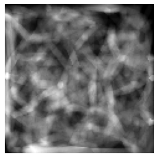

Example
=======

Generating a simple Voronoi-based Trabecular Model
--------------------------------------------------

::

   import matplotlib.pyplot as plt
   from bonebox.Phantoms.TrabeculaeVoronoi.zoo import RandomDropout

   # Parameters for generating phantom mesh

   volume_extent = (3,)*3 # in mm
   volume_ndim = (120,)*3 # number of pixels in each dimension
   mean_TbTh = 0.08 # mean trabecular thickness
   std_TbTh = 0.01 # standard deviation of trabecular thickness

   # Generate trabecular bone phantom based on random dropout

   volume = RandomDropout.generate(volume_extent=volume_extent,
                                   volume_ndim=volume_ndim,
                                   mean_TbTh=mean_TbTh,
                                   std_TbTh=std_TbTh)

   # Plot integral through volume
   plt.imshow(np.sum(volume,axis=2),cmap="gray");plt.axis("off")

